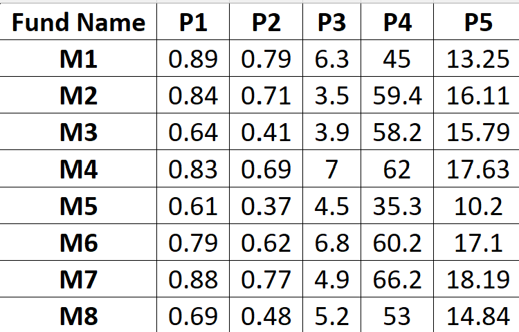
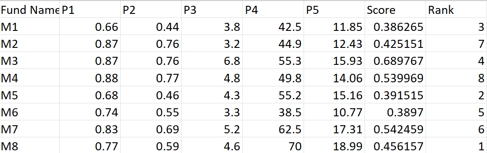

# TOPSIS Implementation in Python

This Python project implements the Technique for Order Preference by Similarity to Ideal Solution (TOPSIS). The algorithm ranks alternatives based on multiple criteria, considering their relative importance (weights) and impacts (benefit or cost).

## Features

- **Input Validation**: Checks for correct input parameters, file format, and consistency in weights/impacts.
- **Error Handling**: Handles file-related errors, invalid data, and incorrect inputs gracefully.
- **Outputs**: Saves results including scores, rankings, and all original columns into a CSV file.

---

## How to Use

1. Go to your terminal and install the package
   ```bash
   pip install topsis-Akshat-102203644
2. Prepare you data in python file app.py
   ```bash
from topsis_Akshat_102203644.topsis import calculate
import pandas as pd

# Load your dataset
data = pd.read_csv("102203644-data.csv")

# Extract only the criteria columns (excluding model name or ID)
matrix = data.iloc[:, 1:].values

# Define weights and impacts
weights = [1, 1, 1, 1, 1]                    
impacts = [+1, +1, +1, +1, +1]               # +1 for benefit, -1 for cost

3. 
3. Use the following command to run the program:
   ```bash
   python app.py
You can access my package through this [link](https://pypi.org/project/topsis-Akshat-102203644/#description)


## Input dataset


## Weights used
[1,1,1,1,1]

## Impacts used
[-1,1,1,-1,1]
### 1 for benifit
### -1 for cost

## Output

